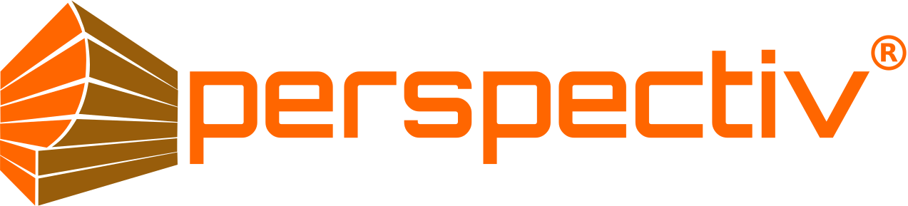

<div align="center">
  
  
  <h1>Perspectiv Labs Website</h1>
  <p><em>Official company website repository</em></p>
  
  
  
  
</div>

---

## About This Project

This repository contains the source code for the official Perspectiv Labs website - a modern, responsive web application showcasing AI vision systems and industrial inspection solutions.

## Features

✅ **Responsive Design** - Optimized for mobile, tablet, and desktop  
✅ **Interactive Components** - Product modals with detailed specifications  
✅ **Performance Optimized** - Fast loading with modern build tools  
✅ **SEO Ready** - Structured data and meta optimization  
✅ **Accessibility** - WCAG compliant components  
✅ **Modern Stack** - Built with latest web technologies  

## Quick Start

```bash
# Clone the repository
git clone https://github.com/raghusbhat/perspectiv.git
cd perspectiv

# Install dependencies
npm install

# Start development server
npm run dev

# Open http://localhost:5173
```

## Available Scripts

| Script | Description |
|--------|-------------|
| `npm run dev` | Start development server with hot reload |
| `npm run build` | Create production build |
| `npm run preview` | Preview production build locally |
| `npm run lint` | Run ESLint for code quality |

## Project Structure

```
perspectiv/
├── public/                 # Static assets
│   ├── logo.svg           # Company logo
│   └── *.png              # Client logos and product images
├── src/
│   ├── components/        # Reusable UI components
│   │   └── ui/           # Base UI components (shadcn/ui)
│   ├── layouts/          # Page layout components
│   ├── routes/           # Page components
│   ├── lib/              # Utility functions
│   └── assets/           # Source assets
├── .gitignore            # Git ignore rules
├── package.json          # Dependencies and scripts
└── README.md            # This file
```

## Development Guidelines

### Code Style
- TypeScript strict mode enabled
- ESLint for code quality
- Consistent naming conventions
- Mobile-first responsive design

### Component Standards
- Functional components with TypeScript
- Props interfaces for type safety
- Accessible markup (ARIA labels, semantic HTML)
- Consistent styling with Tailwind CSS

### Browser Support
- Chrome/Edge 90+
- Firefox 88+
- Safari 14+
- Mobile browsers (iOS Safari, Chrome Mobile)


```bash
# Build for production
npm run build

# Deploy directory: dist/
```

## License

This project is proprietary software owned by Perspectiv Labs LLC®.  
All rights reserved. Unauthorized reproduction or distribution is prohibited.

## Support

For technical issues with the website:
- Create an issue in this repository
- Include browser version and steps to reproduce
- Add screenshots if applicable
---